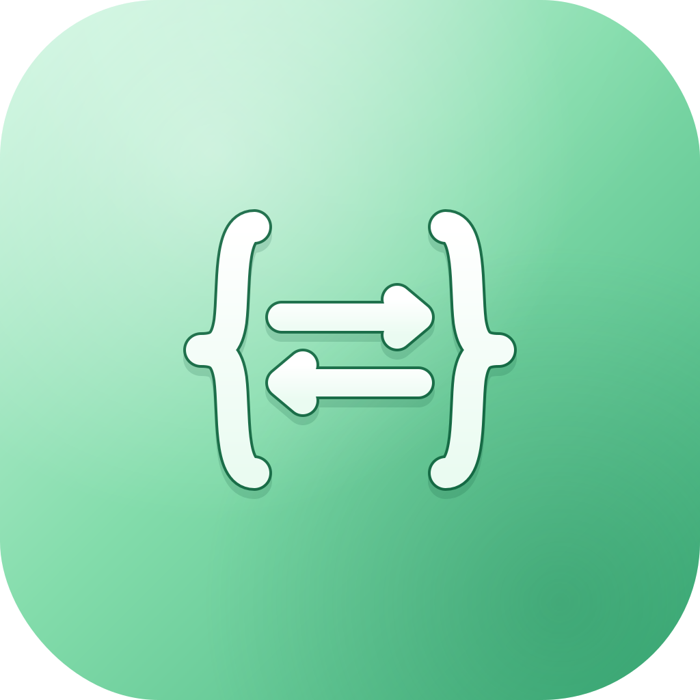
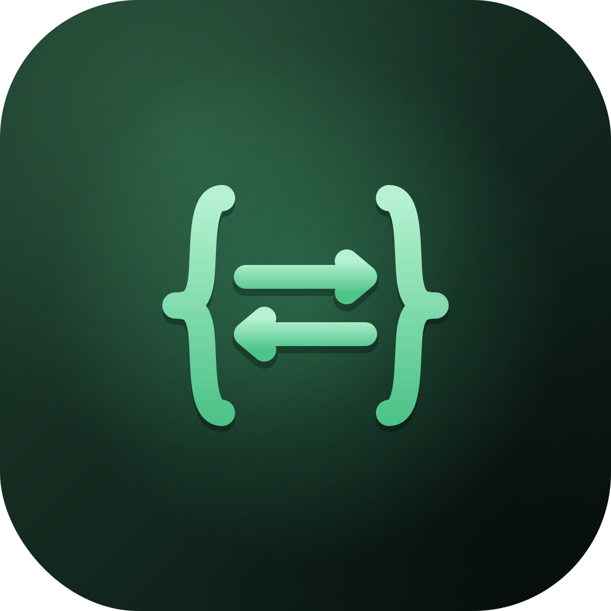

# my-qt-qml-pro-projects-showcase

## qt-qml-from-beginner-to-pro

The project shows the Qt QML topics I learned and contains modules ready to be
built and run.

---

## qt-qml-deploy-to-desktop-mobile-and-embedded/RESTClientV2

The project shows my ability to do cross-platform deployment and CI / CD pipelines.

### Topics
- Windows Deployment
- Linux Deployment
- macOS Deployment
- Android Deployment
- iOS Deployment
- Embedded Linux ARM (Raspberry Pi)

### Icons

---
